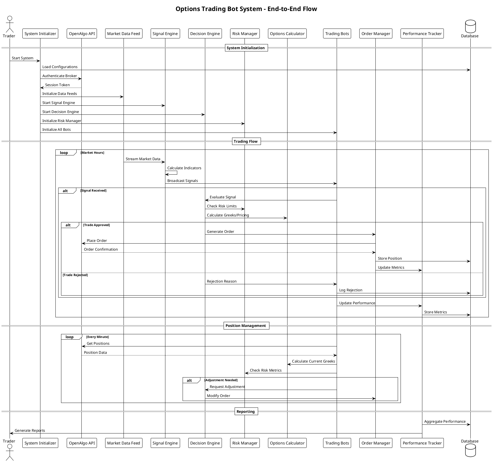

# Options Trading Bot System - Complete Implementation Todo List
## Python-based Multi-Strategy Bot with OpenAlgo API Integration

## Phase 1: Configuration Framework

### Configuration Items Setup
- [ ] **Design Capital Allocation Configuration**
  - Total capital: ₹10L
  - Bot allocations:
    - Short Straddle Bot: ₹2L (20%)
    - Iron Condor Bot: ₹1L (10%)
    - Volatility Expander Bot: ₹2.5L (25%)
    - Momentum Rider Bot: ₹1.5L (25%)
    - Emergency Reserve: ₹1L (20%)
  - Create JSON/YAML configuration files for easy modification

- [ ] **Set Up Database Schema Configuration**
  - Design tables for:
    - Bot capital tracking
    - Option positions
    - Trade history by each bot
    - Performance metrics
    - Signal logs

## Phase 2: Core Initialization and OpenAlgo Integration

### 2.1 OpenAlgo Integration - Detailed Implementation Plan

- [ ] **Understand OpenAlgo Architecture**
  - **What**: OpenAlgo provides unified API access to multiple Indian brokers. Broker being Zerodha identify each API to enable trade lifecycle 
  - **Why**: Single integration point instead of multiple broker APIs
  - **Approach**: Study OpenAlgo documentation and endpoint structure. https://docs.openalgo.in/

- [ ] **Integration via openalgo**
  - **Option Chain Endpoint**: `/api/v1/optionchain/{symbol}/{expiry}`
    - **Why needed**: Core data for option strategy selection
    - **What it provides**: Strike prices, premiums, OI, volume, Greeks
    - **Usage**: Strategy selection, entry/exit decisions
  
  - **Live Quotes Endpoint**: `/api/v1/quotes`
    - **Why needed**: Real-time position monitoring
    - **What it provides**: LTP, bid/ask, market depth
    - **Usage**: P&L calculation, stop-loss monitoring
  
  - **Historical Data Endpoint**: `/api/v1/historical`
    - **Why needed**: Backtesting and indicator calculation
    - **What it provides**: OHLCV data at various intervals
    - **Usage**: Technical analysis, volatility calculation

- [ ] **Order Management via openalgo**
  - **Place Order Endpoint**: `/api/v1/placeorder`
    - **What to handle**: Order validation, capital checks, error handling
    - **Order types**: LIMIT, MARKET, SL, SL-M
    - **Products**: MIS (Intraday), NRML (Positional)
  
  - **Modify Order Endpoint**: `/api/v1/modifyorder/{order_id}`
    - **Usage**: Adjust pending orders based on market movement
  
  - **Cancel Order Endpoint**: `/api/v1/cancelorder/{order_id}`
    - **Usage**: Risk management, strategy adjustments

- [ ] **Set Up Position Tracking**
  - **Positions Endpoint**: `/api/v1/positions`
    - **What it provides**: Open positions, average price, P&L
    - **Usage**: Real-time portfolio monitoring
    - **Implementation**: Polling mechanism with caching

- [ ] **Implement WebSocket Integration**
  - **Purpose**: Low-latency real-time data
  - **What to build**:
    - Connection manager with auto-reconnect
    - Subscription management for instruments
    - Data parsing and distribution to bots
    - Error handling and fallback mechanisms

### 2.2 System Initializer Design

- [ ] **Create Master Initializer Class**
  - **Purpose**: Bootstrap entire trading system
  - **Responsibilities**:
    - Load all configurations
    - Initialize database connections
    - Establish broker connections
    - Start all trading engines
    - Initialize all bots with allocated capital
    - Begin monitoring systems

- [ ] **Design Initialization Sequence**
  1. Configuration loading
  2. Logging system setup
  3. Database initialization
  4. OpenAlgo connection
  5. Core engines startup
  6. Bot initialization
  7. Monitoring activation
  8. Health check verification

- [ ] **Implement Graceful Shutdown**
  - Cancel all pending orders
  - Optional: Close all positions
  - Save system state
  - Disconnect from all services
  - Generate shutdown report

## Phase 3: Bot Strategy Implementation

### 3.1 Option Selling Bots

#### Short Straddle Bot (₹2L Capital)
- [ ] **Bot Architecture Design**
  - **Strategy**: Sell ATM Call and Put simultaneously
  - **Entry Conditions**:
    - IV Rank > 75%
    - 30-45 DTE
    - Low realized volatility
    - No major events in next 7 days
  
- [ ] **Trade Lifecycle Management**
  - **Entry Process**:
    1. Signal generation from market conditions
    2. Strike selection (ATM)
    3. Position sizing (1-2 lots based on capital)
    4. Order placement through decision engine
    5. Position tracking initiation
  
  - **Position Management**:
    - Monitor Greeks (Delta, Gamma, Theta)
    - P&L tracking in real-time
    - Margin utilization monitoring
    - Adjustment triggers setup
  
  - **Exit Conditions**:
    - 50% profit target reached
    - Stop loss at 2x premium collected
    - 21 DTE remaining
    - IV crush detected
    - Risk parameters breached

#### Iron Condor Bot (₹1L Capital)
- [ ] **Bot Architecture Design**
  - **Strategy**: Sell OTM Call spread + OTM Put spread
  - **Entry Conditions**:
    - Range-bound market detection
    - Support/Resistance levels identified
    - IV elevated but not extreme
    - 30-45 DTE
  
- [ ] **Trade Lifecycle Management**
  - **Entry Process**:
    1. Identify trading range
    2. Calculate optimal strike distances
    3. Risk/reward optimization
    4. Four-leg order execution
    5. Greeks neutralization
  
  - **Position Management**:
    - Delta-neutral adjustments
    - Wing protection monitoring
    - Profit zone tracking
    - Time decay optimization

### 3.2 Option Buying Bots

#### Volatility Expander Bot (₹2.5L Capital)
- [ ] **Bot Architecture Design**
  - **Strategy**: Buy straddles/strangles before volatility expansion
  - **Entry Conditions**:
    - IV Rank < 25%
    - Upcoming events detected
    - Historical volatility patterns
    - Technical breakout imminent
  
- [ ] **Trade Lifecycle Management**
  - **Entry Process**:
    1. Event calendar scanning
    2. Volatility compression detection
    3. Position sizing (Max ₹50K per trade)
    4. Strike selection optimization
    5. Entry timing based on event schedule
  
  - **Exit Strategy**:
    - Post-event volatility spike
    - Time-based exits
    - Trailing stop implementation
    - Partial profit booking

<!-- #### News Event Bot (₹2L Capital)
- [ ] **Bot Architecture Design**
  - **Strategy**: Trade around scheduled news events
  - **Events to track**:
    - Earnings announcements
    - RBI policy meetings
    - Budget announcements
    - Economic data releases -->
  
- [ ] **Trade Lifecycle Management**
  - **Pre-Event Positioning**:
    1. Event impact assessment
    2. Volatility analysis
    3. Direction bias determination
    4. Position establishment (Max ₹40K)
  
  - **Event Management**:
    - Real-time news monitoring
    - Rapid position adjustment
    - Post-event exit planning

#### Momentum Rider Bot (₹ 2L Capital)
- [ ] **Bot Architecture Design**
  - **Strategy**: Directional options on momentum breakouts
  - **Entry Conditions**:
    - Price breakout confirmation
    - Volume surge detection
    - Momentum indicators alignment
    - Trend strength validation
  
- [ ] **Trade Lifecycle Management**
  - **Entry Process**:
    1. Breakout detection
    2. Direction confirmation
    3. ATM/slightly OTM selection
    4. Position sizing (Max ₹25K)
  
  - **Position Management**:
    - Trailing stop implementation
    - Momentum exhaustion detection
    - Partial profit booking
    - Trend reversal monitoring

## Phase 4: Core Engine Integration

### 4.1 Signal Engine Development

- [ ] **Design Signal Engine Architecture**
  - **Purpose**: Generate trading signals for all bots
  - **Components**:
    - Technical indicators module
    - Options-specific indicators (IV, PCR, Skew)
    - Event detection system
    - Pattern recognition
    - Multi-timeframe analysis
  
- [ ] **Signal Generation Pipeline**
  1. Data ingestion from OpenAlgo
  2. Indicator calculation
  3. Signal strength scoring
  4. Confidence level assignment
  5. Signal distribution to bots

- [ ] **Integration Points**
  - Input: Market data, option chain, events
  - Processing: Technical analysis, statistical models
  - Output: Structured signals with metadata
  - Consumers: All trading bots

### 4.2 Decision Engine Development

- [ ] **Design Decision Engine Architecture**
  - **Purpose**: Evaluate signals and make trading decisions
  - **Responsibilities**:
    - Signal validation
    - Risk assessment
    - Capital availability check
    - Position sizing
    - Order generation
  
- [ ] **Decision Flow Process**
  1. Receive signal from Signal Engine
  2. Validate against bot rules
  3. Check risk parameters
  4. Verify capital allocation
  5. Consult Options Calculation Engine
  6. Generate execution plan
  7. Send to Order Management

- [ ] **Risk Integration**
  - Portfolio Greeks limits
  - Correlation checks
  - Drawdown controls
  - Position concentration limits

- [ ] **Market Regime Detection System**

  - Build market environment classifier (trending/ranging/volatile)
  - Implement regime-specific strategy selection
  - Create adaptive parameter adjustment based on market conditions
  - Historical regime analysis for strategy performance

### 4.3 Options Calculation Engine

- [ ] **Build Greeks Calculator**
  - Delta, Gamma, Theta, Vega computation
  - Portfolio-level Greeks aggregation
  - Real-time Greeks monitoring
  - Greeks-based risk limits

- [ ] **Implement Pricing Models**
  - Black-Scholes implementation
  - IV calculation from market prices
  - Volatility smile modeling
  - Probability calculations

### 4.4 Risk Management Module

- [ ] **Portfolio Risk Management**
  - Real-time margin calculation
  - Portfolio VaR computation
  - Stress testing scenarios
  - Correlation monitoring

- [ ] **Bot-Level Risk Controls**
  - Individual capital limits
  - Maximum position counts
  - Loss limits per bot
  - Exposure concentration

## Phase 5: Performance Tracking System

### 5.1 Bot Performance Metrics

- [ ] **Individual Bot Tracking**
  - **Metrics to track**:
    - Total P&L
    - Win rate
    - Average profit/loss per trade
    - Maximum drawdown
    - Sharpe ratio
    - Capital utilization
    - Risk-adjusted returns
  
- [ ] **Comparative Analysis**
  - Bot performance ranking
  - Correlation analysis
  - Capital efficiency comparison
  - Risk-adjusted performance

### 5.2 System-Wide Analytics

- [ ] **Portfolio Analytics**
  - Combined P&L tracking
  - Portfolio volatility
  - Diversification benefits
  - System health metrics

- [ ] **Real-time Dashboard**
  - Live P&L by bot
  - Capital utilization charts
  - Risk metrics display
  - Trade activity log
  - Performance attribution

### 5.3 Reporting System

- [ ] **Automated Reports**
  - Daily performance summary
  - Weekly bot analysis
  - Monthly strategy review
  - Risk reports
  - Capital allocation efficiency

## Phase 6: System Architecture Diagram

## Success Criteria

1. **System Stability**: 99.9% uptime during market hours. Each bot should operate  independently on data arrival
2. **Order Execution**: <100ms latency for order placement
3. **Risk Management**: Zero breach of capital allocation limits
4. **Performance Tracking**: Real-time P&L accuracy within 0.1%
5. **Bot Independence**: Each bot operates within allocated capital with >60% trade success rate
6. **Integration Success**: Seamless data flow between all engines

## Timing Precision:
1. Entry within 30 minutes of signal
2. Exit within 1-2 minutes of trigger
3. No overnight holds for intraday strategies